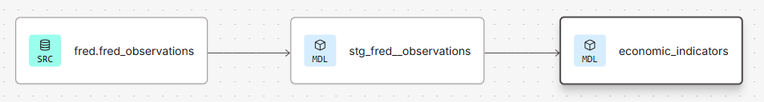

# FRED Economic Data Dashboard

End-to-end data pipeline ingesting Federal Reserve economic indicators into Snowflake, modeled with dbt, and visualized in Data (Looker) Studio.

## Live Dashboard

[View Dashboard →](https://datastudio.google.com/reporting/7cfaa663-9ac0-480d-a814-ee6d0d072419)

## Architecture

```
FRED API → Python (ingestion) → Snowflake (raw) → dbt (staging → marts) → Data Studio
```

Automated weekly via GitHub Actions (ingestion) and dbt Cloud (transformation).

dbt lineage:


## Indicators

| Indicator | Series | Frequency | Data Starts |
|---|---|---|---|
| Unemployment Rate | UNRATE | Monthly | 1948 |
| Labor Force Participation Rate | CIVPART | Monthly | 1948 |
| Consumer Price Index | CPIAUCSL | Monthly | 1947 |
| Federal Funds Effective Rate | FEDFUNDS | Monthly | 1954 |
| Real GDP Growth Rate | A191RL1Q225SBEA | Quarterly | 1947 |
| Real Median Household Income | MEHOINUSA672N | Yearly | 1984 |

## Design Decisions

**Truncate and reload** — Full reload on every ingestion run rather than incremental. Since the dataset is small (~4,000 rows total), this is the simplest strategy with no deduplication logic needed.

**Retry 500 errors** — The FRED API sometimes returns a 500 error. These are handled by three retries with exponential backoff to ensure that the data pipeline is robust in the face of server hiccups.

**Key-pair authentication** — Since Snowflake is deprecating password authentication, key-pair authentication (encrypted private key with passphrase) is implemented in both development and production.

**One raw table for all series** — Data from all series land in a single Snowflake table with a `series_id` column to distinguish them rather than one table per series. This is possible because all series share an identical schema (`date`, `value`). This makes it easy to add a new series without creating a new table or updating the staging layer.

**One mart for all charts** — A single mart serves all charts rather than one mart per chart or section. Each series is pivoted into its own column (long to wide), with one row per month (the lowest common denominator). This means only one Data Studio source connection is needed.

**No intermediate layer** — Analysis of the data reveals that FRED already returns clean month-start dates for all series, and complete months with no gaps for all monthly series, so date truncation or a date spine is not needed.

**No forward fill** — The quarterly and annual series retain nulls for non-reporting months rather than forward filling since nulls are more honest and convey useful information about the reporting cadence. Data Studio natively handles quarterly and yearly dimensions in time series charts.

**Nulls preserved throughout pipeline** — FRED uses `"."` for missing observations (from the 2025 government shutdown). These are converted to NULL at ingestion and carried through staging and marts unchanged. Null filtering is handled per chart in Data Studio (to only show dates where data is available). This keeps the mart a faithful representation of the source data.

**Weekly ingestion/transformation** — FRED publishes updates for different series at different times during the month. A weekly cadence ensures that the dashboard reflects fresh data within a week of any release. Ingestion runs via GitHub Actions and transformation via dbt Cloud, triggered two hours apart on the same schedule.

## Stack

| Layer | Tool |
|---|---|
| Ingestion | Python (pandas, requests, tenacity) |
| Storage | Snowflake (Standard, X-Small Warehouse) |
| Transformation | dbt Cloud |
| Orchestration | GitHub Actions, dbt Cloud |
| Dashboard | Data (Looker) Studio |